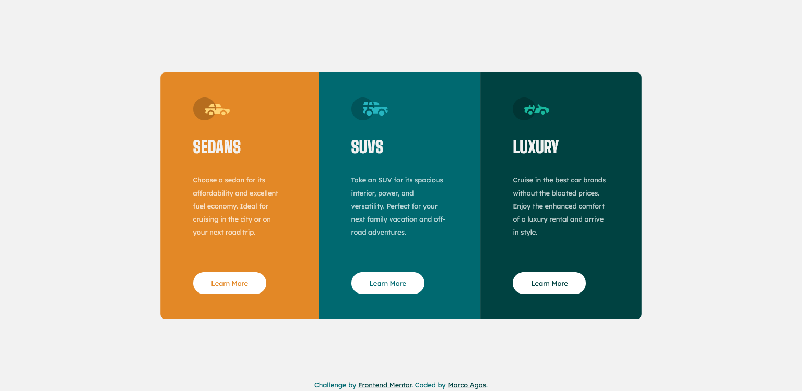

# Frontend Mentor - 3-column preview card component solution

This is a solution to the [3-column preview card component challenge on Frontend Mentor](https://www.frontendmentor.io/challenges/3column-preview-card-component-pH92eAR2-). Frontend Mentor challenges help you improve your coding skills by building realistic projects. 

## Table of contents

- [Overview](#overview)
  - [The challenge](#the-challenge)
  - [Screenshot](#screenshot)
  - [Links](#links)
- [My process](#my-process)
  - [Built with](#built-with)
  - [What I learned](#what-i-learned)
  - [Continued development](#continued-development)
  - [Useful resources](#useful-resources)
- [Author](#author)
- [Acknowledgments](#acknowledgments)

**Note: Delete this note and update the table of contents based on what sections you keep.**

## Overview

### The challenge

Users should be able to:

- View the optimal layout depending on their device's screen size
- See hover states for interactive elements

### Screenshot




### Links

- Solution URL: [Add solution URL here](https://your-solution-url.com)
- Live Site URL: [Add live site URL here](https://your-live-site-url.com)

## My process

### Built with

- Semantic HTML5 markup
- CSS custom properties
- Flexbox
- Mobile-first workflow

### What I learned

I learned a lot in this activity. Got better with centering, as well as using links as buttons instead. Also - CSS VARIABLES! I'm in love with them now. Would like to move to SASS soon, but these do the job.

```css
:root {
    --bright-orange: hsl(31, 77%, 52%);
    --dark-cyan: hsl(184, 100%, 22%);
    --very-dark-cyan: hsl(179, 100%, 13%);
    --transparent-white: hsla(0, 0%, 100%, 0.75);
    --light-gray: hsl(0, 0%, 95%);
    --dark-gray:hsla(0, 0%, 17%, 0.644);
  }
```

### Continued development

I'd definitely like to focus more on the use of variables as well as SVGs.

### Useful resources

- [Using links as buttons](https://stackoverflow.com/questions/29628701/i-want-to-add-a-border-to-my-button-on-hover-event-without-moving-the-button-or) - Because buttons got so annoying.


## Author

- Website - [Marco](https://www.thejc.co.za)
- Frontend Mentor - [@marcojhb](https://www.frontendmentor.io/profile/yourusername)

**Note: Delete this note and add/remove/edit lines above based on what links you'd like to share.**
